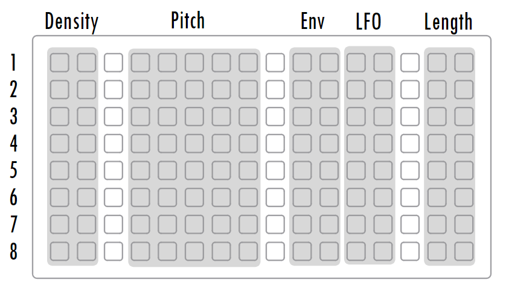

# rudiments

an 8 voice lofi percussion synthesizer...

## Installation

From the Maiden Project Manager (http://norns.local)

Or [Download latest release](https://github.com/cfdrake/rudiments/archive/master.zip) and copy files into `~/dust/code/rudiments`.

Or use Git:

```
<ssh into your Norns>
$ cd ~/dust/code
$ git clone https://github.com/cfdrake/rudiments.git
```

Note that after installing you must `SYSTEM => RESET` your Norns before running this script, as it includes a new SuperCollider engine.

## Norns Script

Launching randomizes all voices, and drops you into a euclidean sequencer. Controls are as follows:

```
E1 select
E2 density
E3 length
K2 reset phase
K3 start/stop

K1 = ALT
ALT-E1 = bpm
ALT+K3 = randomize all voices
```

Use the `PARAMS` menu to configure voices manually, set up clock/sync behavior, MIDI map, and manage voice presets.

## Grid Control
Tap in & clear rhythms with 1-4, nudge synth parameters up & down with 5-10.  Randomize the synth voice with 15


## SuperCollider Engine

This script makes a new SuperCollider engine available, `Rudiments`. Please see `lib/engine_rudiments.sc` for the latest parameter definitions.

## Thanks

Thanks to [@rbxbx](http://github.com/rbxbx) for porting the playfair sequencer to this engine.
